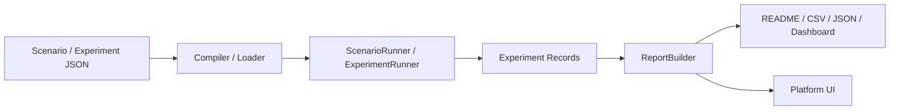

# satmodel

`satmodel` 是一个面向卫星姿态控制研究的 Python 仿真平台。  
它从单场景姿控仿真库出发，正在收敛成一套可复现实验、可批量运行、可自动归档、可通过中文界面展示结果的平台化工作流。

项目当前希望打通这条研究链路：

`物理模型 -> 场景配置 -> 实验计划 -> 批量运行 -> 结果归档 -> 中文界面分析`

## 项目定位

这个仓库适合三类工作：

1. 姿态控制算法验证  
   用 `PD`、`LADRC`、`MEKF`、反作用轮和扰动模型快速搭建闭环实验。
2. 可复现实验组织  
   用 `ScenarioSpec`、`ExperimentPlan`、参数扫描和 Monte Carlo 固化研究过程。
3. 中文平台展示  
   用本地平台界面、Dashboard、姿态回放和结果图做课程展示、答辩演示和阶段汇报。

它当前不是一个重型航天工程软件，也不是完整任务级轨道分析器。  
更准确地说，它是一套面向卫星姿控实验的平台骨架，重点在研究可用性和平台可演进性。

## 当前能力

### 1. 仿真内核

- 四元数刚体姿态动力学与固定步长传播
- `PD`、`LADRC` 控制器
- `MEKF` 姿态估计与可选惯量辨识
- 理想力矩执行器与四轮金字塔反作用轮
- 重力梯度、残余磁矩、气动、太阳压等扰动
- 轻量轨道、地磁和大气环境接口

### 2. 平台工作流

- `ScenarioSpec`：场景配置描述
- `ExperimentPlan`：实验计划描述
- `ExperimentRunner`：统一实验运行入口
- `PlatformProject`：工作区、场景、结果目录管理
- `ReportBuilder`：实验报告、索引和结果汇总生成

标准实验根目录通常会生成：

- `experiment_manifest.json`
- `study_manifest.json`
- `index.json`
- `summary_metrics.csv`
- `README.md`
- `dashboard.html`

每个 `run` 目录通常会生成：

- `manifest.json`
- `metrics.csv`
- `time_history.csv`
- `events.csv`
- `README.md`

### 3. 中文平台界面

项目提供本地中文平台界面，当前入口包括：

- 平台总览
- 实验库
  - 实验主线
  - 实验地图
  - 示例入口
  - 模板库
- 创建实验
- 计划管理
  - 实验选择 / 计划资产总览
  - 焦点计划
  - 主线看板
  - 资产主线
  - 下一步动作
- 结果总览
  - 结果驾驶舱 / 结果入口板
- 结果对比
  - 关键 Run 对比 / 对比入口板
- 姿态回放
  - 三维回放 / 回放入口板
- Dashboard 预览

界面采用左侧导航 + 右侧工作台布局，重点把实验设计、计划管理、结果阅读和回放演示做成一条连续流程。

当前界面已支持基于 URL hash 的工作台定位。刷新页面后会保留当前页签和子工作台，也可以直接分享诸如 `#page=results&results=overview&resultsOverview=browser&resultsBrowser=risk` 这样的结果入口。

## 适合直接复用的实验

仓库已经内置一批可直接运行的实验模板。

| 类别 | 代表实验 | 用途 |
| --- | --- | --- |
| 最小闭环 | `quick_pd_zero` | 验证最小姿态保持闭环 |
| 平台展示 | `quick_pd_showcase` | 用于第一次平台演示 |
| 主线 Showcase | `quick_pd_showcase -> controller_benchmark_showcase -> orbital_environment_showcase -> sun_transition_showcase -> fault_wheel_showcase` | 用固定 5 步演示平台主线 |
| 支线 Showcase | `sensor_quality_showcase` / `disturbance_breakdown_showcase` / `earth_transition_showcase` | 在主线讲清楚后继续深入感知链、扰动解释和对地任务 |
| 参数扫描 | `quick_pd_gain_sweep` / `quick_pd_damping_sweep` | 比较控制参数影响 |
| Monte Carlo | `quick_pd_seed_mc` | 评估随机初值或扰动下的稳健性 |
| 控制器对比 | `quick_controller_benchmark_compare` | 比较 `PD` 与 `LADRC` |
| 环境敏感性 | `quick_environment_compare` | 比较 zero / orbital 环境差异 |
| 验收门限 | `quick_pd_acceptance_gate` | 把结果转成通过/失败判断 |
| 故障鲁棒性 | `cubesat_rw_fault` / `cubesat_rw_fault_seed_mc` | 研究反作用轮故障后的稳定性 |
| 任务切换 | `cubesat_rw_sun_transition_curated` / `cubesat_rw_earth_transition_curated` | 演示任务模式切换 |
| 执行器边界 | `cubesat_rw_wheel_capability` / `cubesat_rw_fault_gain_tradeoff` | 分析轮组能力和参数折中 |
| 扰动拆分 | `cubesat_rw_disturbance_breakdown` | 检查主导扰动来源 |

完整实验说明见 [docs/EXPERIMENT_LIBRARY.md](docs/EXPERIMENT_LIBRARY.md)。

## 快速开始

### 环境要求

- Python `>= 3.10`

### 安装

```bash
git clone https://github.com/hao-hi/satellite-platform.git
cd satellite-platform
python -m pip install -e .[dev]
```

如果需要更完整的地球环境或 TLE 支持：

```bash
python -m pip install -e .[dev,earth,tle]
```

### 运行单场景

```bash
satmodel-validate-scenario scenarios/quick_pd_zero.json
satmodel-run-scenario scenarios/quick_pd_zero.json --output results/quick_pd_zero
```

### 运行批量实验

```bash
satmodel-validate-experiment scenarios/quick_pd_experiment.json
satmodel-run-experiment scenarios/quick_pd_experiment.json --output results/quick_pd_experiment
```

### 生成结果 Dashboard

```bash
satmodel-build-dashboard results/quick_pd_experiment --open
```

### 启动中文平台界面

```bash
satmodel-platform-ui --open
```

Windows 下也可以直接双击：

```text
打开平台界面.bat
```

默认地址：

```text
http://127.0.0.1:8765
```

## 两种使用方式

### 方式 A：作为 Python 仿真库

```python
from satmodel import ScenarioRunner, SimulationConfig, build_default_system

system = build_default_system(controller="pd", identify_inertia=True)
config = SimulationConfig(duration=5.0, dt=0.02)
result = ScenarioRunner(system).run(config)

print(result.metrics(config.reference))
```

适合：

- 单场景算法验证
- 控制器 / 估计器原型开发
- 在 Python 中二次封装研究代码

### 方式 B：作为本地实验平台

```bash
satmodel-run-scenario scenarios/quick_pd_zero.json --output results/my_run
satmodel-run-experiment scenarios/quick_pd_experiment.json --output results/my_experiment
satmodel-build-dashboard results/my_experiment --open
satmodel-platform-ui --open
```

适合：

- 配置驱动实验组织
- 多 run 结果汇总与复查
- 中文界面展示与答辩演示

## 平台工作流



当前职责边界：

- 仿真层负责动力学、控制、估计、执行机构和环境
- 平台层负责项目、计划、运行、记录、报告和界面

这样后续接入运行时调度、任务序列、高保真模型和结果数据库时，不需要推翻当前基础。

## 仓库结构

```text
.
|-- src/satmodel/           核心仿真库与平台层
|-- scenarios/              场景与实验计划 JSON
|-- examples/               Python 示例
|-- docs/                   架构、路线图、实验库、界面说明
|-- tests/                  单元测试与平台工作流测试
`-- results/                运行后生成的实验结果
```

第一次进入仓库，建议优先看：

- `src/satmodel/platform/`
- `scenarios/`
- `docs/PROJECT_GUIDE.md`
- `docs/EXPERIMENT_LIBRARY.md`

## 常用命令

```bash
satmodel-validate-scenario scenarios/quick_pd_zero.json
satmodel-run-scenario scenarios/quick_pd_zero.json --output results/quick_pd_zero
satmodel-validate-experiment scenarios/quick_pd_experiment.json
satmodel-run-experiment scenarios/quick_pd_experiment.json --output results/quick_pd_experiment
satmodel-build-dashboard results/quick_pd_experiment --open
satmodel-platform-ui --open
python -m pytest tests/test_platform_workflow.py -q
```

## 文档导航

- [docs/PROJECT_GUIDE.md](docs/PROJECT_GUIDE.md)
- [docs/ARCHITECTURE.md](docs/ARCHITECTURE.md)
- [docs/ROADMAP.md](docs/ROADMAP.md)
- [docs/PLATFORM_PLAN.md](docs/PLATFORM_PLAN.md)
- [docs/EXPERIMENT_LIBRARY.md](docs/EXPERIMENT_LIBRARY.md)
- [docs/PLATFORM_UI_GUIDE.md](docs/PLATFORM_UI_GUIDE.md)
- [docs/REFERENCES.md](docs/REFERENCES.md)

## 路线概览

当前稳定研究库基线由 Git 标签 `v0.1.0-current` 保留。

后续路线按平台化阶段推进：

- `v0.2`：轻量平台骨架
- `v0.3`：平台架构收敛，固化 `PlatformProject / ExperimentPlan / ExperimentRunner`
- `v0.4`：运行时与任务序列，向 `process / task / module` 范式靠拢
- `v0.5`：高保真环境、传播、传感器和执行机构建模
- `v0.6`：可视化、实验数据库、结果浏览与发布流程

详细规划见：

- [docs/ROADMAP.md](docs/ROADMAP.md)
- [docs/PLATFORM_PLAN.md](docs/PLATFORM_PLAN.md)

## 测试

运行全部测试：

```bash
python -m pytest -q
```

如果主要修改平台层，优先运行：

```bash
python -m pytest tests/test_platform_workflow.py -q
```

## License

MIT
