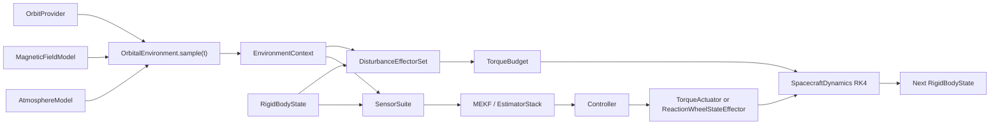

# satmodel 项目说明与物理建模文档

本文档把当前 `satmodel` 的代码结构、仿真流程、物理公式、默认参数和资料来源放在一处说明。
它面向两类读者：

1. 想先跑通项目，再逐步替换物理模型和参数的使用者。
2. 想核对“代码中到底在传播什么物理量”的建模读者。

更细的分专题公式和来源表仍保留在：

- [刚体模型](physics/02_rigid_body_attitude_model.md)
- [环境与扰动](physics/03_disturbance_environment_model.md)
- [反作用轮](physics/04_reaction_wheel_model.md)
- [来源与参数追溯](physics/05_sources_and_parameter_traceability.md)

## 1. 项目定位

`satmodel` 是一个面向姿态控制研究的轻量 Python 仿真包。它当前关注：

- 刚体卫星姿态传播
- 外部轨道环境采样
- 姿态扰动力矩预算
- 理想体轴力矩和反作用轮轮组两种执行机构路径
- 简化姿态/角速度测量
- MEKF 姿态估计
- 可选对角惯量 RLS 辨识
- PD、LADRC 控制器与参数调优辅助

它不是完整任务分析器，也不是高保真轨道传播器。当前默认模型刻意保持轻量：

- 轨道默认是圆轨道解析状态，不做 J2、三体、机动和数值轨道传播
- 姿态真值模型默认是刚体，不做柔性模态、燃料晃动和关节多体
- 气动和太阳光压默认使用盒体投影面积，不做面元遮挡、自阴影和复杂材料
- 太阳方向与地影仍是简化模型
- IGRF、NRLMSIS 和 TLE 只提供可选适配入口，默认安装不依赖外部地球模型包

这个取舍对应项目当前目标：先得到一个可组合、可追溯、便于替换的姿控被控对象，再按任务需要升级物理复杂度。

## 2. 代码入口和模块分层

### 2.1 推荐入口

最常用入口有两条：

```python
from satmodel import ScenarioRunner, SimulationConfig, build_default_system

system = build_default_system(controller="pd", identify_inertia=True)
result = ScenarioRunner(system).run(SimulationConfig(duration=5.0, dt=0.02))
print(result.metrics())
```

```python
from satmodel import ScenarioRunner, SimulationConfig, build_cubesat_reaction_wheel_system

system = build_cubesat_reaction_wheel_system(controller="pd")
result = ScenarioRunner(system).run(SimulationConfig(duration=6.0, dt=0.02))
print(result.wheel_speeds_rad_s.shape)
```

两条路径的关键差别是执行机构：

| 构造器 | 默认用途 | 执行机构 |
| --- | --- | --- |
| `build_default_system()` | 控制器、估计器、辨识器快速闭环验证 | `TorqueActuator`，直接裁剪本体系力矩 |
| `build_cubesat_reaction_wheel_system()` | 1U CubeSat 反作用轮研究 | `ReactionWheelStateEffector`，分配轮力矩并传播轮速 |

### 2.2 模块地图

| 模块 | 主要职责 |
| --- | --- |
| `system.py` | 系统装配、单速率场景循环、默认系统构造 |
| `types.py` | 状态、环境上下文、测量包、结果与轮组遥测数据对象 |
| `dynamics.py` | 四元数刚体动力学、RK4 积分、轮动量耦合 |
| `environment.py` | 轨道源、地理坐标边界、地磁/大气后端、环境采样 |
| `disturbances.py` | 重力梯度、残余磁、气动、太阳光压力矩 |
| `geometry.py` | 共享盒体几何与投影面积 |
| `physics.py` | 质量属性、1U CubeSat 演示物理配置 |
| `actuators.py` | 理想力矩执行器、反作用轮参数、轮组分配与限幅 |
| `sensors.py` | 简化姿态传感器和陀螺 |
| `estimation.py` | MEKF 和估计器组合 |
| `identification.py` | 角加速度辅助、扰动重构、对角惯量 RLS |
| `controllers.py` | PD 与三轴 LADRC |
| `optimization.py` | 网格、随机、Nelder-Mead、退火和 PSO 调参工具 |

### 2.3 当前装配关系



当前分层的核心原则是：

- `OrbitalEnvironment` 给出外部状态和场，不直接替卫星求所有力矩
- `DisturbanceEffectorSet` 根据卫星状态、几何和环境上下文求扰动力矩
- `SpacecraftDynamics` 只传播刚体和附着的状态效应器
- 反作用轮属于有内部状态的执行机构，不是控制器后的一行饱和函数

## 3. 单步仿真流程

`ScenarioRunner` 每个固定步长执行：

1. 读取当前 `RigidBodyState(q, omega, t)`。
2. 由 `environment.sample(t)` 得到轨道位置、速度、地磁、大气密度、太阳方向、地影和绝对时刻。
3. 由 disturbance effectors 计算具名 `TorqueBudget`。
4. 由 `SensorSuite` 生成姿态测量和陀螺测量。
5. 由估计器更新姿态、角速度、陀螺偏置和可选惯量估计。
6. 控制器按参考姿态输出本体系力矩命令。
7. 执行机构输出实际本体系力矩。
8. `SpacecraftDynamics` 用控制力矩、扰动力矩和轮组动量做 RK4 传播。
9. 把真值、估计、测量、力矩分项和轮组遥测记录到 `SimulationResult`。

仿真是单速率固定步长结构，因此它适合快速比较模型和控制器。若后续要研究多速率传感器、执行器延迟或飞控调度，应在 runner 层扩展，而不是把这些逻辑塞进单个物理模块。

## 4. 从仿真库演进到平台

当前版本适合在 Python 代码中直接构造系统、运行单个场景并读取 `SimulationResult`。这对控制律验证、估计器调试和论文式数值实验已经足够清晰，但完整平台还需要项目工作区、实验计划、运行编排、记录器和报告器分层。

平台化演进分两步：

1. `v0.2` 先提供配置驱动场景和 `StudyRunner` 兼容入口。
2. `v0.3` 起以 `PlatformProject`、`ExperimentPlan` 和 `ExperimentRunner` 作为长期主平台入口，`StudyRunner` 只作为兼容壳。

当前平台流为：

```text
Project / Workspace
  -> ExperimentPlan
  -> ScenarioSpec
  -> ScenarioCompiler
  -> SatelliteSystem + SimulationConfig
  -> ScenarioRunner
  -> run 级 manifest/metrics/time_history/report
  -> experiment 级 README/index/summary/manifest
```

因此，`ScenarioRunner.run(SimulationConfig)`、`build_default_system()` 和 `build_cubesat_reaction_wheel_system()` 仍应保持可用。平台能力负责把“项目资源、场景意图、实验批次和结果产物”组织起来，不改变底层物理组件的职责。

### 4.1 轻量场景配置草案

第一阶段配置可以保持轻量，不强制绑定某个第三方 schema 框架。JSON 或 YAML 都可以表达同一类信息：

```yaml
schema_version: 1
metadata:
  name: cubesat_rw_pd_demo
  description: 1U CubeSat 四反作用轮 PD 闭环演示

time:
  duration_s: 20.0
  dt_s: 0.02
  seed: 42

system:
  builder: cubesat_reaction_wheel
  controller: pd
  identify_inertia: false
  environment: orbital

controller:
  pd_kp: 0.05
  pd_kd: 0.02

sensors:
  attitude:
    noise_std_rad: 0.0006
  gyro:
    noise_std_rad_s: 0.001
    bias_std_rad_s: 0.002
    bias_rw_scale: 0.02

environment:
  epoch_utc: "2026-01-01T00:00:00Z"
  sun_vector_eci: [1.0, 0.2, 0.1]
  orbit:
    provider: keplerian
    semi_major_axis_m: 6878137.0
    eccentricity: 0.001
    inclination_deg: 97.6
    raan_deg: 15.0

actuators:
  reaction_wheels:
    layout: pyramid_4wheel
    max_torque_nm: 0.007
    initial_speeds_rad_s: [0.0, 0.0, 0.0, 0.0]
    allocation: bounded_pinv

faults:
  - target: reaction_wheel
    action: disable
    index: 0
    when_s: 0.0

acceptance:
  max_final_error_deg: 5.0
  max_rms_error_deg: 20.0
  max_peak_torque_nm: 0.2

initial_state:
  use_default: true

outputs:
  root: results/cubesat_rw_pd_demo
  save_metrics_csv: true
  save_time_history_csv: true
  save_markdown_report: true
```

这个草案描述第一阶段已经具备的场景信息：时间、随机种子、系统构造、控制器参数、传感器噪声、初始状态、参考姿态、轻量轨道环境、反作用轮配置、起始轮事件、验收门限和输出。后续版本应优先在 `ExperimentPlan`、runtime 和 mission sequence 层增加异步采样、模式切换和参考切换，而不是扩张单个场景字段。

### 4.2 轻量实验产物

第一阶段单个 run 目录建议包含：

| 文件 | 作用 |
| --- | --- |
| `manifest.json` | 记录场景名、schema 版本、随机种子、satmodel 版本、运行时间、验收结果和关键配置摘要。 |
| `metrics.csv` | 保存每个 run 的初始误差、末端误差、RMS 误差、控制力矩积分、峰值力矩和验收结果。 |
| `time_history.csv` | 保存常用时序量，便于用表格工具或脚本复查。 |
| `events.csv` | 保存稀疏事件日志；当前记录场景中的起始反作用轮故障。 |
| `README.md` | 自动生成的人读报告，说明场景、参数、指标和主要结论。 |

实验根目录还会包含：

| 文件 | 作用 |
| --- | --- |
| `summary_metrics.csv` | 汇总所有 run 的指标、参数、系统选择、故障数量、验收结果和输出目录，便于批量筛选和画图。 |
| `study_manifest.json` | 记录 study 级生成时间、satmodel 版本、run 数和摘要行。 |
| `experiment_manifest.json` | 记录平台实验计划、场景、扫描/Monte Carlo 设置、可选 runtime/mission 描述、结果 schema 和 run 摘要。 |
| `runtime_schedule.json` | 当 `ExperimentPlan` 包含 runtime 时生成，保存 process/task/module 展开的确定性事件列表。 |
| `mode_timeline.json` | 当 `ExperimentPlan` 包含 mission 时生成，保存任务步骤、模式区间和参考切换信息。 |
| `index.json` | 面向后续结果浏览、可视化和自动筛选的机器可读索引，并指向可选 runtime/timeline 文件。 |
| `dashboard.html` | 可直接打开的中文实验结果界面，用于筛选 run、查看指标图、验收状态、姿态误差动画、姿态误差/角速度/力矩时序图、runtime schedule 和 mode timeline。 |

本地中文操作界面可以通过 `satmodel-platform-ui --open` 启动。它会扫描 `scenarios/` 目录中的场景和实验计划，并提供查看/校验场景、创建实验计划、校验、运行、结果摘要浏览、关键 run 对比、本地三维姿态回放、任务模式时间线与运行时调度联动，以及内嵌 dashboard 预览。

复杂数据格式可以后置：Parquet 更适合大规模批量指标分析，HDF5 更适合保存稠密高维遥测和回放数据。但在 `v0.2`，优先形成可运行、可复现、少依赖的工作流。

### 4.3 成熟平台式后续边界

平台化后续阶段按成熟项目范式推进：

- v0.3 平台架构收敛：`satmodel.platform` 已拆成 `plan.py`、`runner.py`、`records.py`、`reporting.py` 和 `project.py`，`core.py` 仅作为兼容转发入口。
- v0.4 运行时与任务序列：已引入 `RuntimeProcess`、`RuntimeTask`、`RuntimeModule`、`MissionSequence` 和 `ModeTimeline` 的轻量骨架，并提供 `single_rate`、`single_mode` 和 `detumble_then_hold` 模板，先作为正常任务流程、多速率调度和参考/模式切换的描述与验证层。
- v0.5 高保真建模：按 environment setup、propagation setup、spacecraft model、actuator model、sensor model 分层升级。
- v0.6 可视化和产品化：实验数据库、结果浏览、run 对比、姿态动画、仿真结果图、更高保真三维回放、发布流程和 schema 迁移。

这些能力应继续复用现有组件边界，避免把任务逻辑、文件读写或可视化代码混入动力学、控制器和扰动模型。

仓库的 `scenarios/` 目录提供了可直接验证和运行的 JSON 场景模板。推荐先执行：

```bash
satmodel-validate-scenario scenarios/quick_pd_zero.json
```

确认配置可编译后再运行：

```bash
satmodel-run-scenario scenarios/quick_pd_zero.json --output results/platform/quick_pd_zero
```

## 5. 状态、坐标系和单位约定

### 5.1 姿态状态

当前姿态状态为：

$$
x_{att} = \{q_{BN}, \omega_{BN}^{B}, t\}
$$

其中：

| 量 | 说明 |
| --- | --- |
| `q_BN` | 标量在前四元数 |
| `omega_BN_B` | 本体系表达的角速度，单位 `rad/s` |
| `t` | 场景相对时间，单位 `s` |

`body_to_inertial_dcm(q)` 把本体系向量旋到惯性参考系，`inertial_to_body_dcm(q)` 为其转置。

### 5.2 轨道与环境上下文

`OrbitState` 使用：

| 字段 | 单位 |
| --- | --- |
| `position_eci_m` | `m` |
| `velocity_eci_m_s` | `m/s` |

`EnvironmentContext` 至少包含：

- `position_eci`
- `velocity_eci`
- `magnetic_field_eci`
- `density`
- `sun_vector_eci`
- `eclipse`
- `epoch_utc`
- `geodetic`

这里的 ECI 是当前项目用于姿态扰动计算的惯性-like 边界。默认圆轨道和二体 Kepler 源在该边界内使用解析状态；`TLEOrbitProvider` 把 SGP4 输出当作可消费的惯性-like 轨道输入，当前项目不在内部做更完整的参考系链路建模。

### 5.3 时间边界

仿真步使用相对秒数，环境层持有绝对 `epoch_utc`：

$$
t_{utc}=epoch_{utc}+t
$$

这一步对 IGRF、NRLMSIS、TLE 和 ECI 到地理坐标转换都很重要。没有绝对时刻，高保真地磁、大气和地理位置输入就不完整。

## 6. 卫星本体与刚体姿态动力学

### 6.1 质量属性和几何

`MassProperties` 保存：

- 质量 `m`
- 本体系惯量矩阵 `I_B`
- 质心坐标 `r_cm`

1U 演示模型先用均匀盒体惯量：

$$
I_{box,x} = \frac{m}{12}(l_y^2+l_z^2)
$$

其余两轴循环替换即可。首版 CubeSat 演示模型还把四个轮的偏置质量贡献折成简化各向同性项：

$$
I_{demo} = I_{bus} + N_{rw}m_{rw}r_{off}^{2}I_3
$$

这是演示量级近似，不等同 CAD 质量属性。若已知每个部件的位置与自身惯量，应改用完整平行轴定理：

$$
I_P=I_C+m\left((d^Td)I_3-dd^T\right)
$$

盒体几何由 `BoxGeometry` 共用。投影面积写成：

$$
A_{box}(n_B)
=l_y l_z|n_x|+l_x l_z|n_y|+l_x l_y|n_z|
$$

气动和太阳光压当前都调用这一个投影面积口径，避免相同几何在多个扰动模块各自复制。

### 6.2 四元数运动学

当前刚体姿态运动学为：

$$
\dot{q}_{BN}=\frac{1}{2}\Omega(\omega_{BN}^{B})q_{BN}
$$

其中：

$$
\Omega(\omega)=
\begin{bmatrix}
0 & -\omega_x & -\omega_y & -\omega_z \\
\omega_x & 0 & \omega_z & -\omega_y \\
\omega_y & -\omega_z & 0 & \omega_x \\
\omega_z & \omega_y & -\omega_x & 0
\end{bmatrix}
$$

积分步末会重新归一化四元数，避免数值漂移把单位四元数约束逐步推开。

### 6.3 刚体欧拉方程

不含轮组内部动量时：

$$
I_B\dot{\omega}
=\tau_{ctrl}^{B}+\tau_{dist}^{B}
-\omega\times(I_B\omega)
$$

代码中 `SpacecraftDynamics.angular_acceleration()` 通过解线性方程得到 `dot(omega)`，默认由固定步长 RK4 积分。

默认 `build_default_system()` 使用 `ASTERIA_LIKE_INERTIA` 作为演示惯量矩阵。它是项目内置仿真基线，不应当作目标卫星飞行惯量。若已有目标卫星质量属性，应在系统装配时替换 `SpacecraftDynamics` 的惯量输入。

### 6.4 理想体轴力矩执行器

`TorqueActuator` 表示直接作用于本体系的力矩源。控制器输出：

$$
\tau_{cmd}^{B}
$$

执行器按每轴限制裁剪为：

$$
\tau_{applied}^{B}=\operatorname{clip}(\tau_{cmd}^{B},-\tau_{max},\tau_{max})
$$

这条路径很适合先比较控制器、估计器和辨识器，不适合研究轮速饱和、轮组动量管理和失效重构。

## 7. 反作用轮模型

### 7.1 单轮状态

第 `i` 个轮由轴向 `a_i`、转动惯量 `J_i`、轮速 `Omega_i` 和电机力矩 `u_i` 描述：

$$
h_i=J_i\Omega_i
$$

$$
J_i\dot{\Omega}_i=u_i
$$

电机力矩先受限：

$$
u_{i,lim}=\operatorname{clip}(u_i,-u_{i,max},u_{i,max})
$$

轮速还受速度上限约束。轮动量容量为：

$$
h_{i,max}=J_i\Omega_{i,max}
$$

`WheelArrayTelemetry` 会记录命令轮力矩、实际轮力矩、轮速、轮动量、轮动量容量、饱和标志和失效标志。

### 7.2 轮组分配

把轮轴列向量拼成矩阵：

$$
A=[a_1,a_2,\cdots,a_n]
$$

正电机力矩增加轮动量，卫星本体得到反向力矩：

$$
\tau_B=-Au
$$

当前轮组默认使用饱和感知的 `bounded_pinv` 分配。教学和回归时仍可显式选择原始 `pinv`。未受限基线为 Moore-Penrose 伪逆：

$$
u^{*}=-A^{+}\tau_{cmd}
$$

默认分配器会先根据单轮力矩上限、当前轮速和本步 `dt` 计算可行轮力矩窗口，再用轻量主动集把超限轮固定到边界并重分配残余力矩。限幅和故障后，真实本体力矩为：

$$
\tau_{applied}=-Au_{limited}
$$

分配误差遥测为：

$$
e_{\tau}=\tau_{cmd}-\tau_{applied}
$$

四轮金字塔首版取冗余对角轴向。三轴可控、命令量级、单轮上限和动量容量由轮组配置共同决定。

冗余轮组还可选择 `nullspace_momentum` 模式。它在不改变本体力矩的 null space 中把轮速缓慢拉向参考轮速。这个机制只管理轮组内部动量分布，不等同于磁力矩器或推力器提供的外部动量卸载。

### 7.3 轮组与刚体耦合

CubeSat 路径采用显式轮动量口径：

$$
h_w^{B}=AJ_w\Omega
$$

$$
I_B\dot{\omega}
+\omega\times(I_B\omega+h_w^{B})
=\tau_{ext}^{B}-Au
$$

所以反作用轮不仅输出 `-Au`，其内部动量也进入刚体陀螺耦合项。这个结构比“控制器输出裁剪后直接塞给刚体”更接近真正轮组被控对象。

## 8. 轨道与环境模型

### 8.1 轨道源分层

当前环境通过 `OrbitProvider` 取得轨道状态：

```text
OrbitProvider.state_at(time_s, epoch_utc) -> OrbitState
```

内置轨道源：

| 轨道源 | 当前用途 |
| --- | --- |
| `CircularOrbitProvider` | 默认 LEO 演示 |
| `KeplerianOrbitProvider` | 常规椭圆二体根数输入 |
| `EphemerisOrbitProvider` | 用户 callable 或状态表插值 |
| `TLEOrbitProvider` | 可选 `sgp4` TLE 适配 |

默认圆轨道半径和平均角速度为：

$$
r=R_E+h,\qquad n=\sqrt{\frac{\mu_E}{r^3}}
$$

面内状态为：

$$
r_{pf}=r[\cos u,\sin u,0]^T
$$

$$
v_{pf}=\sqrt{\frac{\mu_E}{r}}[-\sin u,\cos u,0]^T
$$

再由 RAAN 和倾角旋到当前 ECI-like 参考系。

`KeplerianOrbitProvider` 解椭圆 Kepler 方程：

$$
M=E-e\sin E
$$

再从偏近点角构造 perifocal 位置和速度。它适合常规二体轨道定义，但仍不传播 J2 引起的长期摄动。

### 8.2 地理位置边界

`OrbitalEnvironment.sample()` 会把轨道位置与绝对时刻转换为 `GeodeticPoint`：

- 纬度 `latitude_deg`
- 经度 `longitude_deg`
- 高度 `altitude_m`

内部使用 WGS-84 常量和简化 GMST 旋转把 ECI-like 位置转到 ECEF 后求地理坐标。这个边界的价值在于让地磁和大气后端共享相同输入，不让各个扰动模型各自猜测地理位置。

### 8.3 地磁场

默认中心偶极模型为：

$$
B_N=
\frac{\mu_0}{4\pi r^3}
\left(3\hat{r}(m_E^T\hat{r})-m_E\right)
$$

它能保留磁场量级和随半径衰减趋势，适合残余磁扰动的工程基线。

若需要官方主磁场口径，可使用 `IGRFMagneticField`。适配器接收：

- 绝对时刻
- 地理经纬高
- 当前项目环境层提供的坐标边界

当前包通过可选 `ppigrf` 依赖接入，不会在默认安装路径强制拉入外部地磁库。

### 8.4 大气密度

默认指数大气为：

$$
\rho(h)=\rho_{400}\exp\left(-\frac{h-400\,km}{H}\right)
$$

它的用途是给气动力矩一个清晰的一阶密度口径。热层密度会随太阳和地磁活动明显变化，因此该默认值不能拿来做任务级阻力预测。

若需要更完整的热层输入，可使用 `NRLMSISAtmosphere`。该适配器需要：

- 绝对时刻
- 地理位置
- `F10.7`
- `F10.7a`
- `Ap`

项目不在线下载空间天气数据；固定值或 provider 由调用方给出。

### 8.5 太阳方向和地影

当前 `EnvironmentConfig` 默认持有固定太阳方向单位向量。圆柱地影判断为：

$$
r^T\hat{s}<0
$$

且：

$$
\left\|r-(r^T\hat{s})\hat{s}\right\|\le R_E
$$

满足时，当前太阳光压力矩关断。它尚未区分半影、太阳星历变化和姿态相关遮挡。

## 9. 扰动力矩模型

扰动被拆成命名 effectors，统一汇总到 `TorqueBudget`。这让每一项能单独替换、测试和记录。

### 9.1 重力梯度

$$
\tau_{gg}^{B}
=\frac{3\mu_E}{\|r\|^3}
\hat{r}_B\times(I_B\hat{r}_B)
$$

它读取轨道径向和当前惯量矩阵，属于刚体姿态扰动基线项。

### 9.2 残余磁矩

$$
\tau_{mag}^{B}=m_{res}^{B}\times B_B
$$

当前只表示残余磁矩扰动，不表示主动磁力矩器。若后续加入磁力矩器，主动磁控仍会复用 `m x B` 物理关系，但它应属于执行机构子系统。

### 9.3 气动力矩

先考虑地球自转下的相对大气速度：

$$
v_{rel,N}=v_N-\omega_E\times r_N
$$

盒体拖曳力：

$$
F_{drag}^{B}
=-\frac{1}{2}\rho C_D A_{box}\|v_{rel,B}\|v_{rel,B}
$$

压心偏置产生力矩：

$$
\tau_{aero}^{B}=r_{cp,aero}^{B}\times F_{drag}^{B}
$$

当前 CP 偏置、阻力系数和盒体几何都是可换配置。若研究不同面材料和迎风面变化，应升级为面元求和模型。

### 9.4 太阳光压力矩

非地影时：

$$
F_{srp}^{B}
=-P_{\odot}C_R A_{box}(s_B)\hat{s}_B
$$

$$
\tau_{srp}^{B}=r_{cp,srp}^{B}\times F_{srp}^{B}
$$

当前 SRP 与气动一样使用盒体投影面积和单一 CP 偏置。后续 panel 模型应显式描述每个面元面积、法向、材质和作用点。

## 10. 传感器、估计、辨识和控制

### 10.1 简化传感器

`AttitudeSensor` 把真值四元数乘上小角度噪声扰动。`GyroSensor` 输出：

$$
\omega_{meas}=\omega_{true}+b_g+n_g
$$

其中偏置含初始固定偏置和随机游走。当前传感器层没有星敏感器失锁、磁强计标定、太阳敏感器视场和采样异步。

### 10.2 MEKF

MEKF 预测阶段用陀螺去偏置后的增量四元数推进姿态：

$$
q_{k|k-1}=q_{k-1}\otimes\delta q(\omega_{gyro}-b_g,\Delta t)
$$

校正阶段使用姿态测量与预测姿态的乘法误差构造小角残差。滤波器状态误差维度为：

$$
\delta x=[\delta\theta,\delta b_g]^T
$$

实现中姿态误差走乘法修正，协方差更新使用 Joseph 形式保持数值稳健。

### 10.3 对角惯量 RLS

可选惯量辨识只辨识对角惯量：

$$
\theta=[I_x,I_y,I_z]^T
$$

当前回归矩阵按欧拉方程构造：

$$
\Phi(\omega,\dot{\omega})=
\begin{bmatrix}
\dot{\omega}_x & -\omega_y\omega_z & \omega_y\omega_z \\
\omega_x\omega_z & \dot{\omega}_y & -\omega_x\omega_z \\
-\omega_x\omega_y & \omega_x\omega_y & \dot{\omega}_z
\end{bmatrix}
$$

角加速度来自 tracking differentiator，物理残余扰动由：

$$
\tau_{dist,recon}
=I\dot{\omega}-\tau_{applied}+\omega\times(I\omega)
$$

重构后再做滤波与有界 RLS 更新。这个辨识器适合当前对角惯量演示，不等同完整非对角惯量辨识或飞行在轨辨识方案。

### 10.4 控制器

PD 控制器用四元数误差向量部和角速度误差：

$$
\tau_{cmd}
=-K_p q_{e,v}-K_d(\omega-\omega_{ref})
$$

LADRC 用三轴线性扩张状态观测器估计等效未知输入。当前实现把 `b0` 看作三轴输入增益，可由惯量对角估计缓慢更新。LADRC 的内部扰动估计与物理 disturbance effectors 的力矩预算是两类量：

- disturbance effectors 是显式物理模型输出
- LADRC 扰动估计是控制器内部的等效输入补偿量

## 11. 默认参数和数据来源口径

### 11.1 来源分类

当前项目把物理输入分三类：

| 分类 | 含义 | 使用要求 |
| --- | --- | --- |
| 文献/官方资料 | 教材、论文、标准、官方环境模型文档 | 可作公式和接口口径依据 |
| 参考项目参数 | 开源演示提供的首版参数 | 可跑通基线，后续应换成目标硬件数据 |
| `satmodel` 工程假设 | 为形成可观察、可测试基线而设的默认数值 | 不可当作飞行标称值 |

### 11.2 当前重要参数

| 参数或模型 | 默认口径 | 当前来源分类 |
| --- | --- | --- |
| `ASTERIA_LIKE_INERTIA` | 默认 ideal-torque 系统演示惯量矩阵 | `satmodel` 工程基线 |
| 1U 演示总质量 `2.6 kg` | CubeSat 轮组演示基线 | 参考项目参数 |
| 1U 边长 `0.1 m` | CubeSat 轮组演示基线 | 参考项目参数 |
| 单轮质量 `0.13 kg` | 演示惯量近似 | 参考项目参数 |
| 单轮自旋惯量 `2.6e-5 kg m^2` | 轮组配置 | 参考项目推导值 |
| 单轮最大力矩 `0.007 N m` | 轮组配置 | 参考项目参数 |
| 单轮最大轮速 `8000 rpm` | 轮组配置 | 参考项目参数 |
| circular LEO altitude `400 km` | 默认环境 | `satmodel` 工程假设 |
| circular LEO inclination `51.6 deg` | 默认环境 | `satmodel` 工程假设 |
| exponential density reference | 默认大气 | `satmodel` 工程假设 |
| residual dipole and CP offsets | 默认扰动配置 | `satmodel` 工程假设 |
| IGRF 输入 | 历元和大地位置 | 官方模型输入口径 |
| NRLMSIS 输入 | 历元、大地位置、`F10.7`、`F10.7a`、`Ap` | 官方模型输入口径 |

更细的逐参数表见 [来源与参数追溯](physics/05_sources_and_parameter_traceability.md)。

### 11.3 公式和资料映射

| 建模内容 | 当前依据 |
| --- | --- |
| 四元数运动学、刚体欧拉方程、重力梯度力矩 | Wertz；Schaub and Junkins |
| 本体加效应器的结构思路 | Basilisk |
| 刚体/柔性/多体远期边界 | NASA 42；柔性多体相关论文 |
| 轨道环境与面元/宏模型升级路线 | Tudat |
| 任务层航天器资源划分 | GMAT |
| 四轮金字塔、轮限幅和故障演示基线 | `brunopinto900/attitude_control_reaction_wheels` |
| IGRF 和 NRLMSIS 可选后端输入口径 | NOAA IGRF；NASA CCMC NRLMSIS |

## 12. 结果、示例和验证

### 12.1 结果对象

`SimulationResult` 保存：

- 真值四元数与角速度
- 估计四元数与角速度
- 控制命令与实际力矩
- 总扰动力矩和按名称拆分的扰动项
- 姿态/陀螺测量
- 可选惯量估计
- 控制器内部扰动估计
- 轮组遥测

常用指标包括：

- 初始姿态误差
- 末端姿态误差
- RMS 姿态误差
- 力矩作用积分
- 峰值力矩

### 12.2 示例脚本

| 示例 | 说明 |
| --- | --- |
| `examples/open_loop.py` | 开环刚体传播 |
| `examples/pd_closed_loop.py` | PD 闭环 |
| `examples/ladrc_closed_loop.py` | LADRC 闭环 |
| `examples/mekf_rls_identification.py` | MEKF 加 RLS 惯量辨识 |
| `examples/tune_pd.py` | PD 调参 |
| `examples/cubesat_reaction_wheels_pd.py` | 1U 轮控闭环和轮速遥测 |
| `examples/cubesat_wheel_failure.py` | 轮失效冒烟场景 |

### 12.3 当前测试覆盖重点

测试重点围绕：

- 轨道源和环境上下文完整性
- 内置地磁和大气后端趋势
- 可选依赖缺失路径
- 扰动 effectors 回归
- 反作用轮分配、饱和、故障和轮动量交换
- 默认系统闭环和示例脚本可运行

## 13. 适合下一步升级的方向

若目标仍是“常规合理、不要过度复杂”，优先级建议为：

1. 用任务级 `MassProperties` 替换演示惯量和 CP 偏置。
2. 若轨道对扰动变化敏感，切换到 ephemeris/TLE 输入，再评估是否需要独立数值 propagator。
3. 若气动是主要扰动，优先升级密度模型与姿态相关面积，再考虑面元拖曳。
4. 若磁控或磁扰动研究变重要，切换 IGRF 并新增磁力矩器/磁强计边界。
5. 若 SRP 对任务显著，再升级太阳方向、地影和 panel SRP。
6. 只有当刚体假设明显失效时，再引入柔性附件、多体关节和结构模态。

这个顺序和当前架构是一致的：先替换后端和物理配置，再扩展状态维度。

## 14. 参考资料索引

完整索引见 [来源与参数追溯](physics/05_sources_and_parameter_traceability.md)。当前最关键的阅读锚点是：

- Wertz, *Spacecraft Attitude Determination and Control*
- Schaub and Junkins, *Analytical Mechanics of Space Systems*
- Basilisk 航天器/反作用轮文档
- Tudat 环境与航天器宏模型文档
- NASA 42
- GMAT 航天器姿态文档
- NOAA IGRF
- NASA CCMC NRLMSIS
- Lee 等人的反作用轮构型研究
- Markley 等人的反作用轮力矩与动量包络研究
