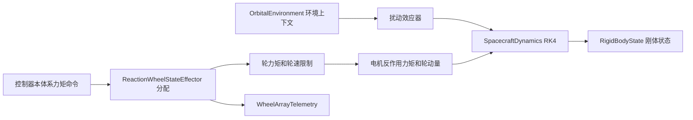

# 01 卫星物理模型架构

## 本轮实现目标

本轮把 `satmodel` 从“理想体轴力矩刚体姿态模型”扩展为两条并行路径：

1. `build_default_system()` 保留原有理想体轴力矩执行器，适合控制器与估算器快速验证。
2. `build_cubesat_reaction_wheel_system()` 新增刚体 1U CubeSat 物理配置和反作用轮轮组，适合先研究轮组分配、饱和和故障遥测。

控制器仍输出本体系期望力矩。CubeSat 路径用 `ReactionWheelStateEffector` 把该命令分配为单轮电机力矩，轮速状态和刚体角速度在同一步 RK4 中耦合传播。默认环境仍沿用圆轨道 LEO 工程近似；组合式环境层已可切换轨道源、IGRF 地磁适配器和 NRLMSIS 大气适配器，面元 SRP 与面元拖曳仍留给后续。

## 参考项目的建模取舍

| 参考 | 卫星建模方式 | 本项目采用的部分 |
| --- | --- | --- |
| [Basilisk spacecraft](https://avslab.github.io/basilisk/Documentation/simulation/dynamics/spacecraft/spacecraft.html) | 本体加状态/动态效应器 | 后续把轮组、柔性件、扰动效应器继续解耦 |
| [NASA 42](https://github.com/ericstoneking/42) | 刚体/柔性多体航天器，面向高保真仿真 | 后续多体、柔性和 HIL 路线 |
| [Tudat macromodels](https://docs.tudat.space/en/latest/user-guide/state-propagation/environment-setup/creation-celestial-body-settings/spacecraft-macromodels.html) | 航天器本体加盒体-太阳翼/面元几何 | 后续从盒体投影面积升级到面元模型 |
| [GMAT attitude](https://documentation.help/GMAT/SpacecraftAttitude.html) | 任务分析中的刚体姿态资源 | 当前刚体真值模型边界 |
| [reaction wheel CubeSat demo](https://github.com/brunopinto900/attitude_control_reaction_wheels) | 单一 CubeSat 场景的刚体、轮组和遥测脚本 | 本轮 1U 参数基线、四轮金字塔和饱和案例 |

本轮选择轻量 CubeSat 路线，是因为它能先暴露姿控被控对象中最关键的执行机构状态，而不把环境、几何和多体传播一次性推到高复杂度。Basilisk 和 Tudat 的分层仍保留在后续路线中。

## 当前数据流

## 当前实现边界

- 刚体姿态状态只含标量在前四元数、角速度和时间。
- `MassProperties` 记录质量、质心和惯量；首版传播只消费惯量。
- `CubeSatPhysicalConfig` 记录盒体几何、质量属性和轮组配置；环境配置由场景层拥有。
- CubeSat 被控对象使用 `ReactionWheelStateEffector` 做伪逆分配并传播轮速和轮动量。
- 轮组耦合传播已纳入 `I omega + h_w` 角动量口径；摩擦、轮系抖振和动量卸载仍留给后续。
- `OrbitalEnvironment.sample()` 只给出外部场上下文，气动、SRP、残磁和重力梯度由独立扰动效应器给出力矩。

## 资料口径

小/微卫星 ADCS 的系统背景优先参考 He et al. 2021、Hu et al. 2022、Hasan et al. 2022、Ovchinnikov and Roldugin 2019、NASA Small Spacecraft Technology State of the Art 和 ECSS AOCS 要求资料。柔性、多体、约束和故障控制论文被保留为后续研究锚点，不直接改变当前刚体首版实现。
